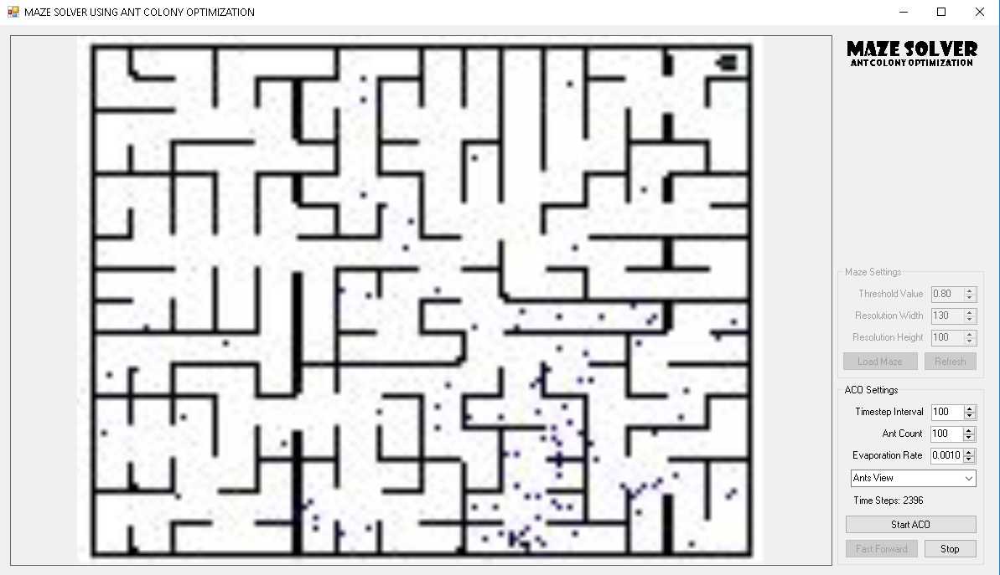
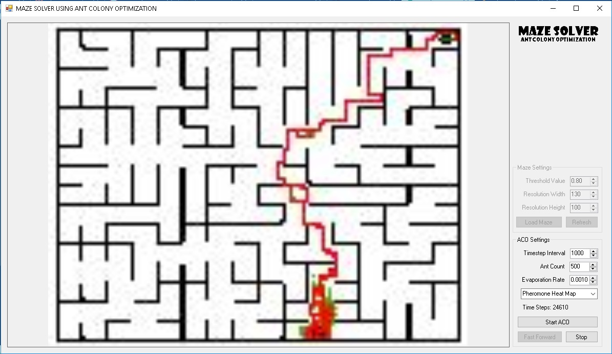

# Maze Solver using Ant Colony Optimization
There's an array of computing problems that can be solved by nature itself. Some of the solutions we have now are inspired by nature, one of which is the Ant-Colony Optimization. It's a heuristic approach in selecting the best from a set of solutions.

**This is a simple demonstration and visualization of how ant colonies pick the best path to thier food.**

Ants finding thier way to thier food randomly

Ants lay of a certain amount of pheromones to thier path to their nest when they've found food. These pheromones will then influence other ants to guide them to the same path used by the first ant that came back with food. More food means more pheromones and more pheromones means more ants to follow the same path and lay off more pheromones. Ants will naturally converge to one path which is most probably the best path.

This is a pheromone heatmap showing how influencial a path is

